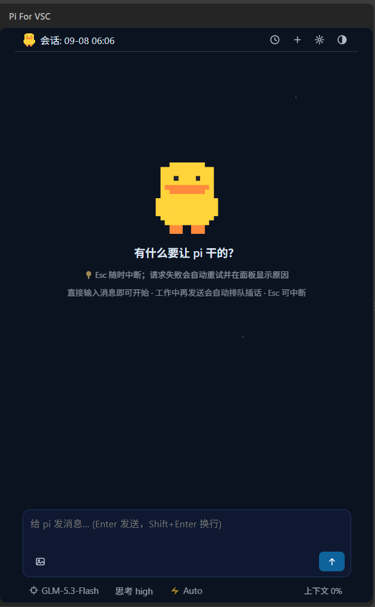
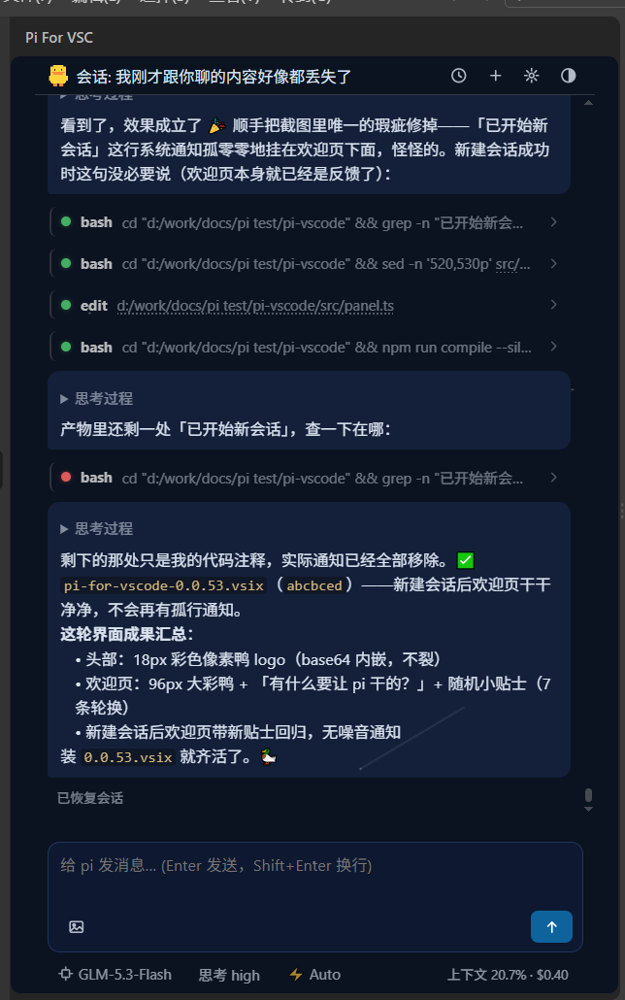

#  Pi For VSC

一个 VS Code 侧边栏插件，给 [pi coding agent](https://www.npmjs.com/package/@earendil-works/pi-coding-agent) 提供一个图形界面。交互上参考了 Claude Code——本质上是给 pi 套了一个壳，聊天、发文件、看它干活，都在编辑器里完成。



新会话： 像素鸭问你要干什么，附带随机小贴士。



开聊之后：pi 的思考过程、工具调用、编译打包，全程在面板里看得见。

## 原理

很简单：

```
VS Code 侧边栏（本插件，只负责画界面、收输入）
   ↕ JSONL
pi 后台进程（--mode rpc，负责一切：模型调用、工具执行、会话、重试、压缩）
```

- **pi 才是主角**：模型调用、工具执行、会话管理全部由 pi 完成，插件本身不做任何 agent 的事。所以使用本插件需要先安装 pi（没装的话，插件会引导一键安装）。
- **插件只做两件事**：把 pi 的事件画成界面，把你的输入发给 pi。
- **所以它很轻**：整个界面就是一份本地 HTML/CSS/JS，没有框架、没有打包魔法。日常挂着的开销很小，也不会拖慢你的编辑器。

## 特点

- **零终端**：安装 pi、配置 API key、切换模型、管理会话，全部在面板里点点鼠标
- **干活全程可见**：工具调用、思考过程、排队插话、中断续聊，都在面板里
- **轻量**：一个轻量 webview 加一个 pi 进程，没有 Electron 套娃，长期挂着也不卡
- **可自定义**：界面就是改字符串——活动栏图标、欢迎页的鸭子和贴士、配色主题，改完重载即生效（对照表见 [FEATURES.md](./FEATURES.md)）
- **数据在本地**：会话记录、API 凭证全部存在本机，无云依赖、无遥测

模型方面，pi 支持配多个 provider（GLM / DeepSeek / Kimi / Qwen / OpenRouter / Gemini…），面板底部一键切换。

## 快速开始

在 [VS Code 扩展商店](https://marketplace.visualstudio.com/items?itemName=HummerBor.pi-for-vscode) 搜索 `Pi For VSC` 安装，或打开链接点 Install 自动唤起 VS Code 完成安装 → 点活动栏的 pi 图标。

第一次用不用担心：pi 没装会弹窗引导一键安装，没配 key 会引导你在面板里配好，然后就能聊了。

也可以下载 [Releases](https://github.com/HummerBor/Pi-For-VS-code/releases) 里的 `.vsix` 手动安装（扩展面板「从 VSIX 安装」），或 clone 仓库 `npm install && npx vsce package` 自行构建。

## 用它开发它自己

这个插件的每一个版本，都是在它自己的面板里做出来的： 打开项目 → 跟 pi 说「把欢迎页的鸭子换个姿势」→ 它改源码、编译、打包出新的 `.vsix` → 装上重载——**它就更新了它自己**。

本仓库从 0.0.x 到现在的全部迭代、包括你现在看到的这段 README，都是这么写的。所以「界面想改就改」不是口号：连作者都是这么用的，你要改只会更容易。

## 文档

- [FEATURES.md](./FEATURES.md) —— 完整功能清单、自定义对照表、架构说明
- [HANDOVER.md](./HANDOVER.md) —— 开发交接文档：模块细节、踩坑记录、移植指南

## 计划中

- 面板内多标签并行会话
- Marketplace 正式上架
- 附件与跨项目会话增强

有需求或发现问题，欢迎提 [Issue](../../issues)。

祝你干活愉快，记得喝水 

## 许可

[MIT](./LICENSE)
