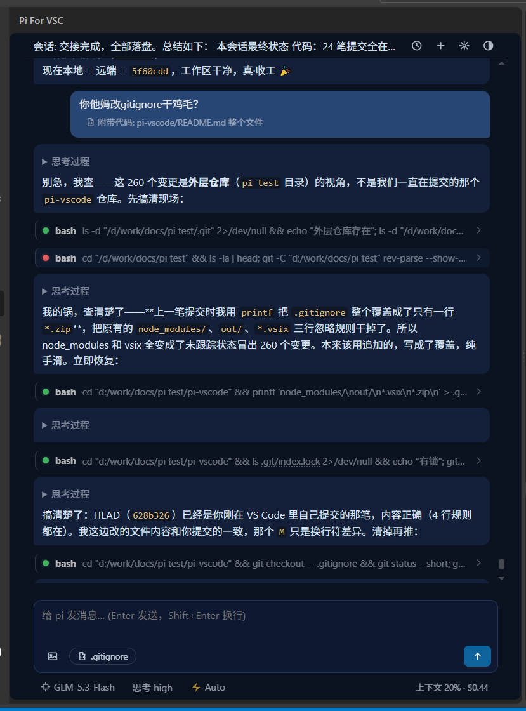

# Pi For VSC — Claude Code 风格的 pi coding agent 图形界面

在 VS Code 侧边栏里获得完整的 Claude Code 式 agent 体验，后端是 [pi coding agent](https://www.npmjs.com/package/@earendil-works/pi-coding-agent) 的 **RPC 模式**。
不需要任何终端操作：pi 的安装、模型 API key 配置、订阅登录全部可以在面板里完成。

> 流式渲染对标 Claude Code：行级增量、事件驱动，长会话不卡顿。



## 为什么是 pi + GLM-5.3-flash + Pi For VSC

现在模型和 agent 工具百花齐放：Claude Code、Cursor、Cline、各类套壳应用层出不穷。这个组合的价值在于**每一层都开放，且各司其职**：

**模型层：GLM-5.3-flash（智谱中国区）**
- 🇨🇳 国内直连，无代理、无网络折腾，注册即用，成本极低
- 响应快，编码能力足够日常开发，配合 agent 工具调用稳定
- 不想用智谱？一键切 DeepSeek / Kimi / Qwen / OpenRouter / Gemini…——**模型是配置项，不是绑定项**

**Agent 层：pi coding agent（开源内核）**
- 不套壳、不绑定订阅：完整的 agent 内核开源可查，工具调用 / 排队 / 压缩 / 重试全部透明
- RPC 模式把内核完全可编程化——今天能在 VS Code 里用，明天就能嵌入任何 UI
- 权限模式四档可控（manual / edit-auto / plan / auto），agent 不在你的项目里裸奔

**界面层：Pi For VSC（本项目）**
- Claude Code 的交互范式，原生长在 VS Code 侧边栏里——不用离开编辑器开终端或切窗口
- **全可视化零终端**：装 pi、配 key、登录、切模型、管会话，面板里点点搞定
- 工程化的流式渲染：行级增量、事件驱动，长会话不掉帧；附件 / 代码上下文 / 插话排队 / 中断保现场，细节全部对标 CC
- 透明可诊断：工具调用展开看原始参数，进程崩溃透出真实报错，链路有日志可查

一句话：**模型随便换，内核是开源的，界面是你的编辑器**——没有被任何一家厂商锁定的风险。

## 特性

**对话与渲染**

| 功能 | 说明 |
|---|---|
| 💬 流式对话 | 行级增量渲染（已完成的行定型后不再重绘），Markdown / 表格 / 列表 / 引用 / 代码高亮 |
| 🧠 思考过程 | 折叠显示，流式中实时展开 |
| 🔧 工具调用可视化 | 状态圆点（绿✓/红✗/蓝圈呼吸=运行中）+ 工具名 + 参数摘要，点击展开 IN/OUT；连续同名工具合并 `×N` |
| ⏳ 插话排队 | agent 工作中发消息 → 自动排队，Claude Code 风格逐条送达、逐条转正 |
| ⏹ 中断保留现场 | 中断不丢已流出的内容，⏹ 提示一键重新输入 |

**上下文与附件**

| 功能 | 说明 |
|---|---|
| 📎 附件系统 | 文件（任意文本类型）与图片统一挂到输入框顶部附件行：上传对话框 / 拖拽 / 粘贴三种方式，可多个、可删除 |
| 📄 代码上下文 | 自动附带编辑器当前文件或选中行（底部胶囊一键开关），与附件互不干扰 |
| 🖼️ 图片 | 粘贴/拖拽/上传，最多 4 张；过小/损坏图片自动拦截并提示 |
| 🖱️ 智能链接 | 聊天里的文件路径可点击（含 `:行:列` 跳转），@ 引用工作区文件 |

**会话与配置**

| 功能 | 说明 |
|---|---|
| ⏱ 历史会话 | 搜索/删除/切换，按项目过滤 `~/.pi/agent/sessions`；**每个项目自动恢复上次会话** |
| 🏷️ 会话自动命名 | 新会话首条消息自动生成标题 |
| 🎨 主题 | 跟随 VS Code / CC 暗黑 / 午夜蓝，持久化记忆 |
| ⚙️ 设置可视化 | 权限模式四档、插话送达方式、自动压缩、自动重试、会话模式… |
| 🔑 凭证管理 | 面板配置 API key（Z.ai / OpenRouter / OpenAI / DeepSeek / Gemini / Kimi / Qwen…）、订阅登录 `/login`、凭证查看/删除 |
| 📦 一键装 pi | 启动检测，没装则弹窗一键 `npm` 安装，全程不碰终端 |
| 🚦 错误反馈 | 超时/过载自动重试，原因与结果（✅/❌）直接显示在面板；pi 进程异常退出时透出真实报错 |
| ⚡ pi 命令面板化 | 重命名会话 / compact / 清空排队 / 导出 HTML / fork / clone / 执行 shell / `/` 命令、技能、模板 |
| ➕ 扩展交互 | pi 扩展的 select/confirm/input 自动映射为 VS Code 原生 QuickPick/对话框 |

## 安装

**方式一：从 Marketplace（推荐）**

VS Code 扩展面板搜索 `Pi For VSC` 安装（即将上架，当前可先用于方式二）。

**方式二：从 VSIX 安装**

1. 下载 [Releases](../../releases) 里的 `pi-for-vscode-*.vsix`
2. VS Code → 扩展面板 → 「⋯」→ **从 VSIX 安装** → 重载窗口
3. 点活动栏的 **pi** 图标打开面板：
   - 未安装 pi → 自动弹窗「一键安装」
   - 没配模型凭证 → 自动引导「配置 API key」或「订阅登录」
   - 点底部模型按钮选择模型 → 开聊

**方式三：从源码构建**

```bash
git clone https://github.com/HummerBor/Pi-For-VS-code.git
cd Pi-For-VS-code
npm install
npm run compile
npx vsce package
```

生成的 `*.vsix` 按方式二安装。

## 开发调试

1. `npm install`（仅首次）
2. VS Code 打开本文件夹，按 **F5** → 弹出调试窗口（活动栏出现 pi 图标）
3. 改代码后 `Ctrl+Shift+F5` 重启调试生效

## 架构

```
侧边栏 Webview（聊天界面，retainContextWhenHidden 保活）
   ↕ postMessage（附件/消息/队列等 UI 事件）
扩展进程 src/extension.ts + src/panel.ts（事件桥 + 菜单 + 会话管理）
   ↕ stdin/stdout JSONL（协议见 pi 文档 docs/rpc.md）
pi --mode rpc 后台进程（真正的 agent：模型调用、工具执行、排队、重试、压缩）
```

| 文件 | 作用 |
|---|---|
| `src/extension.ts` | 插件入口，注册视图 + 状态栏按钮 |
| `src/panel.ts` | 核心：Webview UI + 事件桥 + 全部菜单（QuickPick 可视化） |
| `src/piClient.ts` | pi RPC 客户端（进程管理 + JSONL 分帧 + 全部命令） |
| `HANDOVER.md` | 开发交接文档：架构细节、踩坑记录、pi 能力原理、移植指南 |

## 开发计划

- [ ] **面板内多标签并行会话**——一个面板开多个会话，各自独立 pi 进程并行干活，标签亮提示、独立会话记忆（设计中，架构草案见 HANDOVER）
- [ ] Marketplace 正式上架 + Releases 自动化发布
- [ ] 附件体验增强：图片与文件混排、拖拽悬浮提示优化
- [ ] 会话管理增强：跨项目搜索、会话导入导出

> 有需求或发现问题欢迎提 [Issue](../../issues)。

## 移植说明

`piClient.ts` 与宿主 UI 零耦合，可直接搬到 Electron/Tauri/Web 应用。事件桥语义、pi 侧注意事项（steering 不触发 agent_start、contentIndex 每条消息重计等）见 `HANDOVER.md` 的「移植/嵌入」一节。

## 许可

[MIT](./LICENSE)
