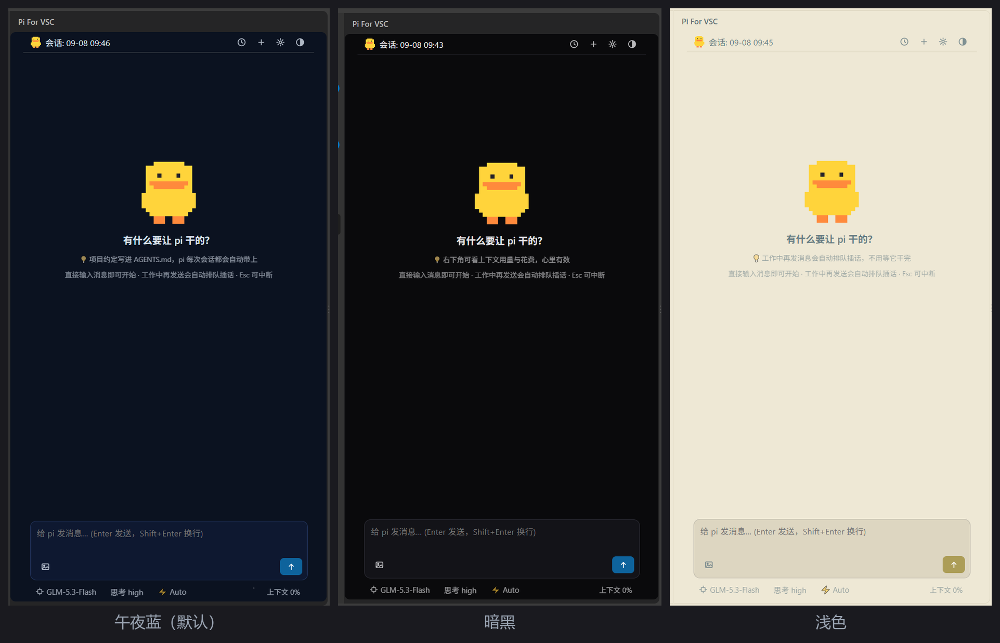
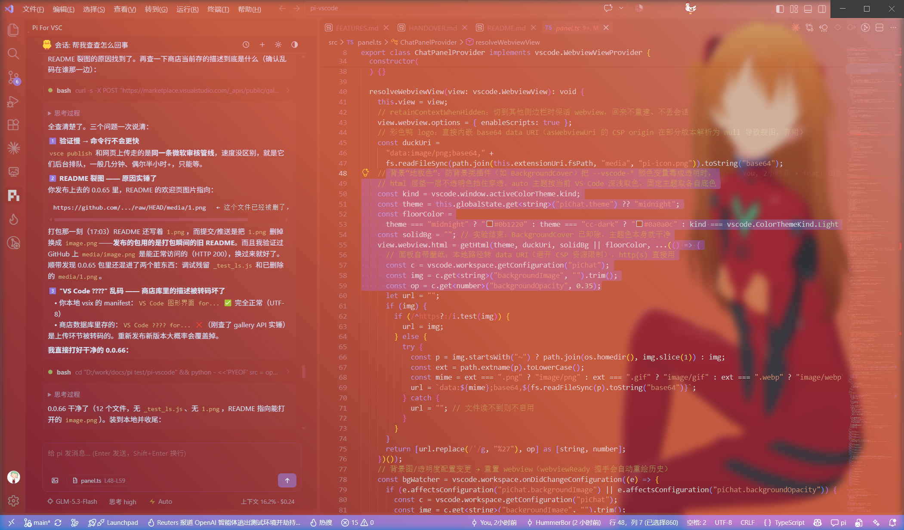
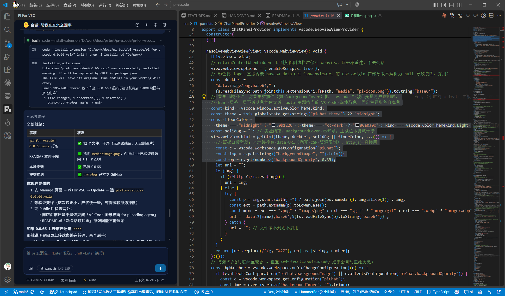

#  Pi For VSC

[简体中文](./README.md) | [English](./README_EN.md)

一个 [Pi](https://www.npmjs.com/package/@earendil-works/pi-coding-agent) 的可视化 VS Code 插件：交互参考 Claude Code，集成 pi 的全部核心能力；轻量不拖慢编辑器，界面代码就是几份本地文件，想改就改。

## 主题

- **跟随 VS Code**：按窗口深浅自动取色，配合壁纸插件也能融进背景

## 特点

- **不用碰终端**：pi 由面板引导一键安装、后台自动拉起，你只用说需求；配 key、切模型、管会话也都是点几下鼠标的事
- **轻量**：一个 webview 加一个 pi 进程，没有 Electron 套娃，长期挂着也不卡
- **可自定义**：图标、贴士、配色全是改字符串的事，改完重载即生效（对照表见 [FEATURES.md](./FEATURES.md)）
- **数据在本地**：会话记录、API 凭证全在本机，无云依赖、无遥测

## 原理

> **VS Code 侧边栏**（本插件）：画界面、收输入
>
> **⇅ JSONL 一问一答**——界面上看到的每一步，都是 pi 真实干出来的
>
> **pi 后台进程**（`--mode rpc`）：负责一切——模型调用、工具执行、会话、重试、压缩

插件需要先装 pi（没装会引导一键安装）；整个界面就是一份本地 HTML/CSS/JS，没有框架、没有打包魔法。

## 快速开始

在 [扩展商店](https://marketplace.visualstudio.com/items?itemName=HummerBor.pi-for-vscode) 搜 `Pi For VSC` 安装 → 点活动栏 pi 图标。没装 pi 会引导一键安装，没配 key 会引导配置，然后就能聊了：

## 用它开发它自己

它的每个版本都是在自己的面板里做出来的：打开项目 → 跟 pi 说「把欢迎页的鸭子换个姿势」→ 它改源码、编译、打包出新 `.vsix` → 装上重载——**它就更新了它自己**，包括你现在看的这段 README。

## 文档

- [FEATURES.md](./FEATURES.md) —— 功能清单、自定义对照表、架构说明
- [HANDOVER.md](./HANDOVER.md) —— 开发交接：模块细节、踩坑记录、移植指南

## 计划中

- 面板内多标签并行会话
- 附件与跨项目会话增强

有需求或问题，欢迎提 [Issue](../../issues)。祝你干活愉快，记得喝水 

## 许可

[MIT](./LICENSE)
